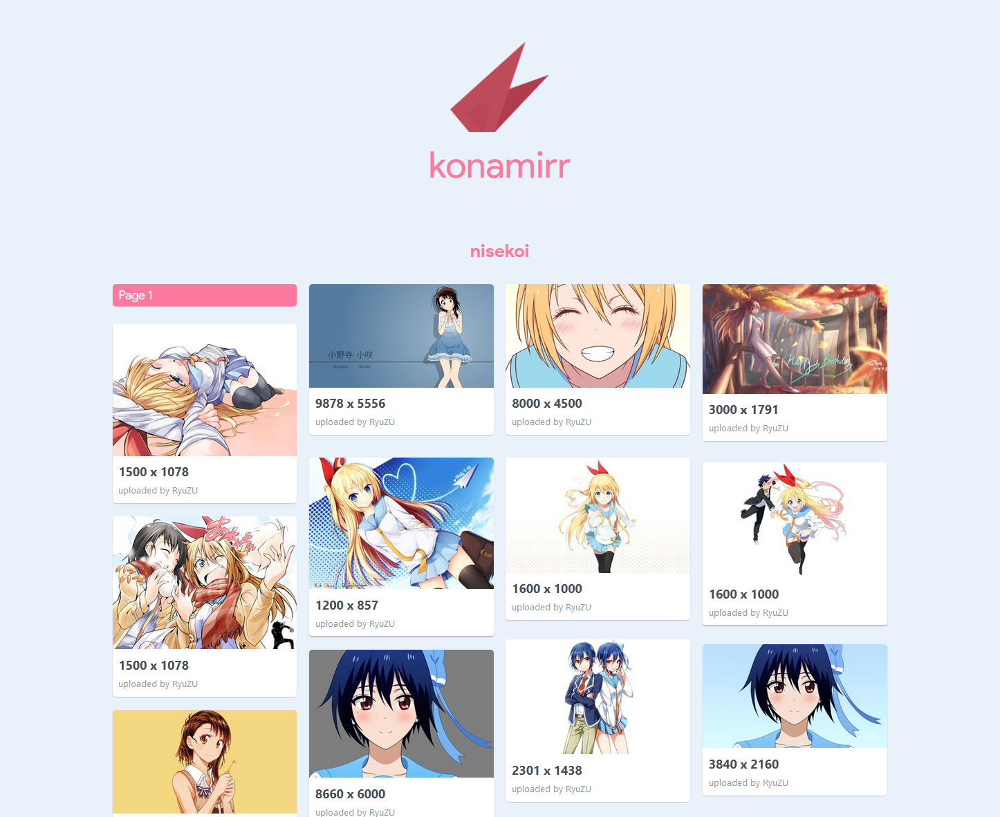

# KonaMirr

A modern Konachan mirror site.

This site is under development, but it is already usable. Please raise issues if
you meet any bug or inconvinence.

This site is currently hosted on [konachan.kcsl.ink](http://konachan.kcsl.ink),
and is synced with this repository.

## Screenshots



## Roadmap

### Finished Features

- Display pictures in Waterfall flow (aka Marsonry)
- Display a single picture and its descriptions (tags, uploader, download link, 
  comments, etc.)
- Search for pictures using query or search bar (should be usable now, leave an 
  issue if not)
- Not reloading the image flow when viewing single images

### WIP Features

- Prettier image page
- Loading indicator (and prettier messages)
- Format comments
- Switching between *safe (G) mode* and *unsafe (R-18) mode* (currently only 
  safe mode is avaliable)
- Remove hardcoded server address

### Planned Features (with priority)

- "Load Previous Page" button for pages > 1 (+10)
- Categorize tags (*characters, authors, original works, and regular tags*) (+5)
- Logging in (+3)
- Uploading, managing and commenting on pictures, tags and wikis (0)
- Posting in forum (-5)
- anything else that can be done in Moebooru (-10)
- *adaptation to other sites (Yandere, Danbooru, ...)* (-10)

## Usage

```bash
$ yarn

# Test on localhost:4000
$ yarn dev

# Build the site
$ yarn build
```

### Changing site

To use other sites' APIs, you need to change the config file at `/client/config.js`.
Currently three URIs are changable: `postList`, `image` and `comment`.

After changing these variables, you need to build the project again.

| Variable   | Value                                                                     |
|------------|---------------------------------------------------------------------------|
| `__TAGS__` | Stringified tags. Combined by `+`. Sample: `tag_1+tag_2`                  |
| `__PAGE__` | Page number. Integer. Sample: `12`                                        |
| `__ID__`   | Image ID. Integer. Other types like HEX are unsupported. Sample: `265713` |

## Requirements

**This website should display properly with embedded Product Sans Font.**  
~~For now, to display the webpage properly, you need to install **Product Sans**
fonts in your computer.~~

~~[Product Sans - Befonts Download Page](https://befonts.com/download/product-sans)~~

## Known Issues

- Changing the query in address bar does not have any effect

## Docs

[Konachan API documentation (incomplete)](docs/konachan_api.md)

## Sources

### [Vue-Waterfall](https://github.com/MopTym/vue-waterfall)

MIT © [MopTym](https://github.com/MopTym)

### [Veturpack](https://github.com/octref/veturpack)

MIT © [Pine Wu](https://github.com/octref)

## License

MIT 
